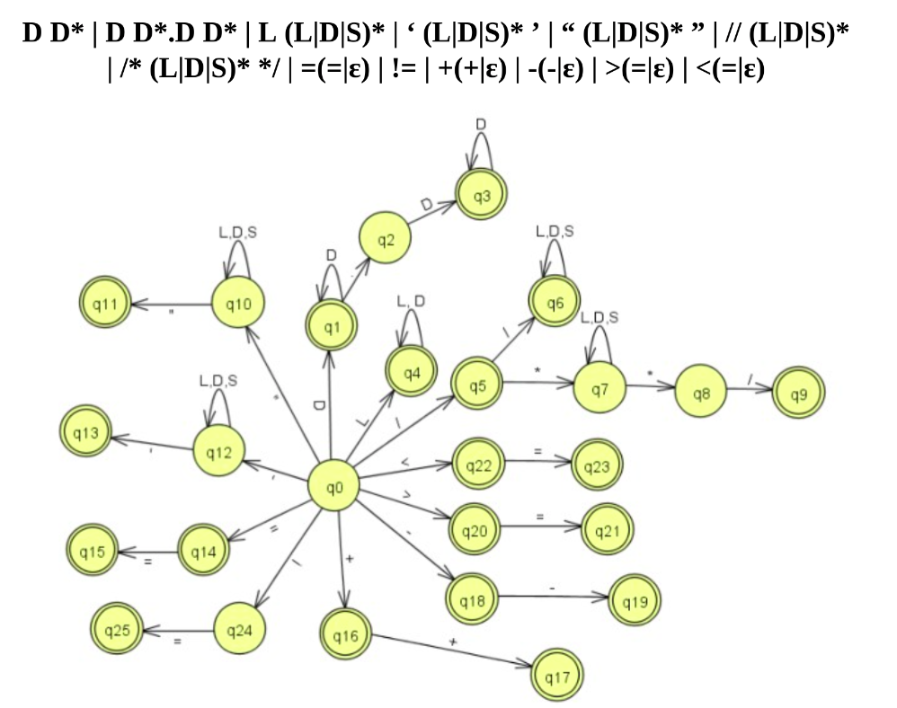

# Manual Tecnico

- [Manual Tecnico](#manual-tecnico)
  - [Automata Utilizado](#automata-utilizado)
  - [Gramatica Para Python](#gramatica-para-python)
  - [Gramatica Para JS (Jison)](#gramatica-para-js-jison)

## Automata Utilizado
El siguiente AFD de la imagen fue utilizado para el traductor de python

## Gramatica Para Python
Gramatica utilizada para python es la siguiente 
    
    <INICIO> := <Program> 

    <Program> := Tk_Public <ClassOrNoOrInterfaz> 
                <Program>
	           |    ε
    
    <ClassOrNoOrInterfaz> := TK_Class TK_id TK_LlaveIzq <contentClass> TK_LlaveDer
		                | Tk_Interfaz Tk_id Tk_LlaveIzq <contentInterfaz> Tk_LlaveDer
    <contentInterfaz> := Tk_Public <FuntionI> <contentInterfaz>
		                |  ε

    <contentClass> := Tk_Public <Content> <contentClass>
		            |  ε

    <Content> := <Type> Tk_Id <FuntionOrNot>
	            | Tk_Static Tk_Void <MainOrNot> 
	            | Tk_Void <MainOrNot>
	            | ε

    <FuntionOrNot> :=  TK_Parizq <Params> Tk_ParDer Tk_LlaveIzq <SentenceList> <SentencesListFuntion> Tk_LlaveDer
		            | <IdList> <OptAssignment> Tk_PuntoComa

    <FuntionI> := <Type> Tk_Id Tk_ParIzq <Params> Tk_ParDer Tk_PuntoComa
	            | Tk_Void Tk_Id Tk_ParIzq <Params> Tk_ParDer Tk_PuntoComa

    <SentencesListFuntion> := <ReturnFuntion> <SentenceList> <SentencesListFuntion>
			                | ε

    <ReturnFuntion> := Tk_Return <Expresion> Tk_PuntoComa

    <MainOrNot> := Tk_Main Tk_ParIzq <ARGS> Tk_ParDer Tk_LlaveIzq <SentenceList> Tk_LlaveDer
	            | Tk_Id Tk_ParIzq <Params> Tk_ParDer Tk_LlaveIzq <SentenceList> <SentencesListMethod> Tk_LlaveDer

    <SentencesListMethod> := <ReturnMethod> <SentenceList> <SentencesListMethod>
			               | ε
    <ARGS> := Tk_String Tk_CorA Tk_CorC Tk_ID
	        | ε

    <ReturnMethod> := Tk_Return Tk_PuntoComa

    <SentenceListLoop> := Tk_Break Tk_PuntoComa
		                | Tk_Continue Tk_PuntoComa
		                | ε

    <Params> := <ParamsDeclaration>
	          |  ε

    <ParamsDeclaration> := <Type> Tk_Id <ParamsList>

    <ParamsList> := Tk_Coma <ParamsDeclaration>
	              |  ε

    <SentenceList> := <DeclarationSentence> <SentenceList>
	                | <AsignmentOrCallSentence> <SentenceList>
	                | <PrintSentence> <SentenceList>
	                | <IfElseSentence> <SentenceList>
	                | <ForSentence> <SentenceList> 
	                | <WhileSentence> <SentenceList> 
	                | <DoWhileSentence> <SentenceList>
	                | ε

    <DeclarationSentence> := <Type> <VariablesDeclaration>

    <VariablesDeclaration> := Tk_Id <IdList> <OptAssignment> Tk_PuntoComa

    <IdList> := Tk_Coma Tk_Id <IdList>
	          |  ε

    <OptAssignment> := Tk_Igual <Expresion> 
	                |  ε

    <AsignmentOrCallSentence> := Tk_Id <OptAOrCall> Tk_PuntoComa

    <OptAOrCall> := Tk_Igual <Expresion> 
                 | Tk_ParIzq <ParameterListCall> Tk_ParDer

    <PrintSentence> := Tk_System Tk_Out <TypePrint> Tk_ParIzq <Impresion> Tk_ParDer Tk_PuntoComa

    <TypePrint> := Tk_Print
	            | Tk_Println 

    <Impresion> := <Expresion> 
	            | ε

    <IfElseSentence> := Tk_IF Tk_ParIzq <Expresion> Tk_ParDer Tk_LlaveIzq <SentenceList> Tk_LlaveDer <OptElse>

    <OptElse> := Tk_Else <ElseIfOpt> 
	            | ε

    <ElseIfOpt> := Tk_LlaveIzq <SentenceList> Tk_LlaveDer 
	             | Tk_IF Tk_ParIzq <Expresion> Tk_ParDer Tk_LlaveIzq <SentenceList> Tk_LlaveDer <OptElse> 

    <ForSentence> := Tk_For Tk_ParIzq <OptType> <AssignmentFor> <Expresion> Tk_PuntoComa <Expresion> <OptIncDec> Tk_ParDer Tk_LlaveIzq <SentenceList> <SentencesListLoop> Tk_LlaveDer

    <OptType> := <Type> 
	          | ε

    <AssignmentFor> := Tk_ID Tk_Igual <Expresion> Tk_PuntoComa
 
    <OptIncDec> := Tk_Increment 
	            | Tk_Decrement
	            | ε

    <WhileSentence> := Tk_While Tk_ParIzq <Expresion> Tk_ParDer Tk_LLaveIzq <SentenceList> <SentencesListLoop> Tk_LlaveDer

    <DoWhileSentence> := Tk_Do Tk_LlaveIzq <SentenceList> <SentencesListLoop> Tk_LLaveDer Tk_While Tk_ParIzq <Expresion> Tk_ParDer Tk_PuntoComa

    <ParameterListCall> := <Expresion> <PList> 
		                | ε

    <PList> := Tk_Coma <Expresion> <PList>
	         | ε 

    <Expresion> := <OptNot> <E> <OptCompareSymbol> <AndOrXorOpt> 

    <OptNot> := Tk_Not <OptNot>
	          | ε 

    <AndOrXorOpt> := Tk_And <Expresion> 
	               | Tk_Or <Expresion>
	               | Tk_Xor <Expresion>
	               | ε

    <OptCompareSymbol> := Token_Comparacion <E>
	                    | Token_Mayor <E> 
		                | Token_Menor <E>
		                | Token_MayorIgual <E>
		                | Token_MenorIgual <E>
	                    | Token_Diferente <E>
		                | ε

    <E> := <T> <EP>

    <EP> := Tk_Mas <T> <EP>
          | Tk_Menos <T> <EP>
          | ε

    <T> := <F><TP>

    <TP> := Tk_Multiplicacion <F> <TP> 
          | Tk_Division <F> <TP> 
          | ε

    <F> := <OptNot> <FF>

    <FF> := Tk_Numero
          | TK_Decimal
          | Tk_String
          | Tk_ID <OptUseFunction>
          | Tk_True
          | Tk_False
          | Tk_ParIzq <E> Tk_ParDer
 
    <OptUseFunction> := Tk_ParIzq <ParameterListCall> Tk_ParDer
	                  | ε
	
    <Type> := TK_Int
	        | Tk_String
	        | Tk_Boolean
	        | Tk_Double
	        | Tk_Char

	       

	       
## Gramatica Para JS (Jison)
Gramatica utilizada para el traducto de JS con la herramienta de JISON
    
    <START> := <ListClass> 'EOF' 
            | 'EOF'
            | error
        
    <ListClass> := <ListClass> <Class>
                | <Class> 
                ;
    <Class> := 'public' 'class' 'identifier' '{' <BODYC> '}' 
	        | 'public' 'interface' 'identifier' '{' <BODYI> '}'
	        | 'public' 'class' 'identifier' '{' '}' 
	        | 'public' 'interface' 'identifier' '{' '}'
	        | 'public' 'class' error '{' <BODYC> '}' 
	        | 'public' 'interface' error '{' <BODYI> '}' 
	        | 'public' 'class' error '{'  '}' 
	        | 'public' 'interface' error '{' '}' 
	        | error ERROR
	        ;

    <BODYC> := <BODYC> <METHODC>
            | <BODYC> <DECLARATION>
            | <DECLARATION>
            | <METHODC> 
            | <DECLARATION>
 	        
            | error <ERROR> 
 	     
            ;
 	
    <BODYI> := <BODYI> <METHODI> 
            | <METHODI> 
            | error <ERROR> 
            ;
         
    <METHODI> := 'public' 'void' 'identifier' '(' ')' ';'
            | 'public' <TYPE> 'identifier' '(' ')' ';'
            | 'public' 'void' 'identifier' '(' <PARAMS> ')' ';'
            | 'public' <TYPE> 'identifier' '(' <PARAMS> ')' ';' 
            | 'public' 'void' error 
            | error <ERROR> 
            ;

         
    <METHODC> := 'public' 'void' 'identifier' '(' ')' <BODY> 
              | 'public' <TYPE> 'identifier' '(' ')' <BODY>
              | 'public' 'void' 'identifier' '(' <PARAMS> ')' <BODY> 
              | 'public' <TYPE> 'identifier' '(' <PARAMS> ')' <BODY> 
              | 'public' error 
              ;

    <TYPE> := 'INT' 
            | 'double' 
            | 'boolean'
            | 'char'
            | 'String'
            ; 

    <PARAMS> := <PARAMS> ',' <PARAM> 
              | <PARAM>
              ; 
 
    <PARAM> := <TYPE> 'identifier' 
            | error
            ;
        
    <BODY> := '{' '}' 
	       | '{' <SENTENCES> '}' 
	       | error
	       ;

    <SENTENCES> := <SENTENCES>  <SENTENCE> 
                | <SENTENCE> 
                ; 

    <SENTENCE> := <DECLARATION> 
	            | <ASSIGMENT> 
	            | <CALLMETHOD> ';'
	            | <PRINTS> 
	            | <IFS> 
	            | <FOR> 
	            | <WHILE> 
	            | <DOWHILE> 
	            | <RETURN> 
	            | <BREAK> 
	            | <CONTINUE> 
	            | error
	            ;

    <DECLARATION> := <TYPE> <IDLIST> ';'
	              ;

    <IDLIST> := <IDLIST> ',' <ID> 	 
             | <ID> 
             ; 

        <ID> := 'identifier' 
                | 'identifier' <ASSIGMENT>

    <ASSIGMENT> := 'identifier' <ASSIGMENTEXPRESSION> ';'
                | 'identifier' '++' ';'
                | 'identifier' '--' ';' 
                ; 
  
    <ASSIGMENTEXPRESSION> := '=' <EXPRESSION> 
		                  ; 
		    
    <EXPRESSION> := <EXPRESSION>  '+' <EXPRESSION> 
	              | <EXPRESSION>  '-' <EXPRESSION>
	              | <EXPRESSION>  '*' <EXPRESSION>
	              | <EXPRESSION>  '/' <EXPRESSION>
	              | <EXPRESSION>  '^' <EXPRESSION>
	              | <EXPRESSION>  '%' <EXPRESSION>
	              | <EXPRESSION>  '<' <EXPRESSION>
	              | <EXPRESSION>  '>' <EXPRESSION>
	              | <EXPRESSION>  '<=' <EXPRESSION>
	              | <EXPRESSION>  '>=' <EXPRESSION>
	              | <EXPRESSION>  '==' <EXPRESSION>
	              | <EXPRESSION>  '!=' <EXPRESSION>
	              | <EXPRESSION>  '||' <EXPRESSION>
	              | <EXPRESSION>  '&&' <EXPRESSION>
	              | '(' <EXPRESSION> ')' 
	              | '-' <EXPRESSION> %prec UMINUS
	              | '!' <EXPRESSION>
	              | 'identifier'
	              | 'stringContent'
	              | 'character'
	              | 'decimal'
	              | 'true'
	              | 'false'
	              | <CALLMETHOD>
	              ;
	     
    <CALLMETHOD> := 'identifier' '(' ')' 
                 | 'identifier' '(' <CALLPARAMS> ')' 
                 ; 
            
    <CALLPARAMS> := <CALLPARAMS> ',' <EXPRESSION>
                 | <EXPRESSION>
                 ;
             
    <PRINTS> := 'print' '(' ')' ';'  
              | 'println' '(' ')' ';' 
              | 'print' <CONDITION> ';' 
              | 'println' <CONDITION> ';' 
              ;
          
    <CONDITION> := '(' <EXPRESSION> ')' 
                | error
                ; 
               
    <IFS> := 'if' <CONDITION> <BODY> 
           | 'if' <CONDITION> <BODY> 'else' <IFS> 
           | 'if' <CONDITION> <BODY> 'else' <BODY>  
           ; 
               
    <FOR> := 'for' '(' <TYPE> 'identifier' <ASSIGMENTEXPRESSION> ';' <EXPRESSION> ';' <ITERATOR> ')' <BODY> 
          | 'for' '(' 'identifier' <ASSIGMENTEXPRESSION> ';' <EXPRESSION> ';' <ITERATOR> ')' <BODY> 
          | 'for' error 
          ;
      
    <ITERATOR> := 'identifier' '++'
               | 'identifier' '--' 
               ; 
           
    <WHILE> := 'while' <CONDITION> <BODY>
            ; 
         
    <DOWHILE> := 'do' <BODY> 'while' <CONDITION> 
              ;
       
    <RETURN> := 'return' ';' 
             | 'return' <EXPRESSION> ';' 
             ; 
         
    <BREAK> := 'break' ';' 
            ; 
        
    <CONTINUE> := 'continue' ';' 
              ;
           
    <ERROR> := '{'
            | '}' 
            | '('
            | ')' 
            | ':'
            | ';' 
            ; 
        
      
	

