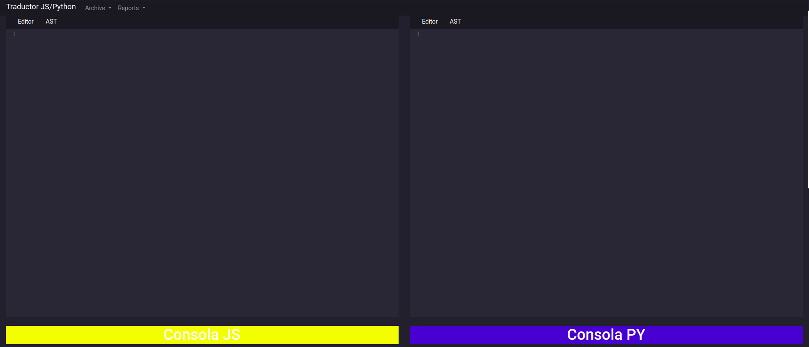
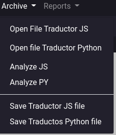
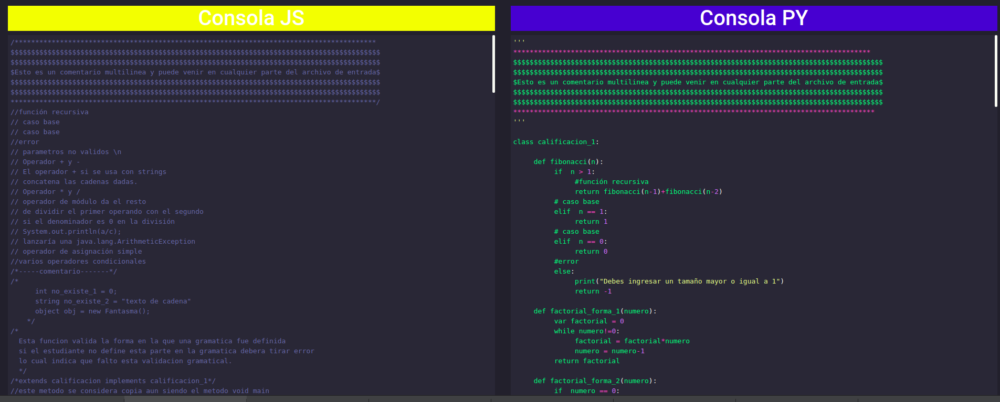
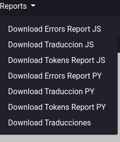
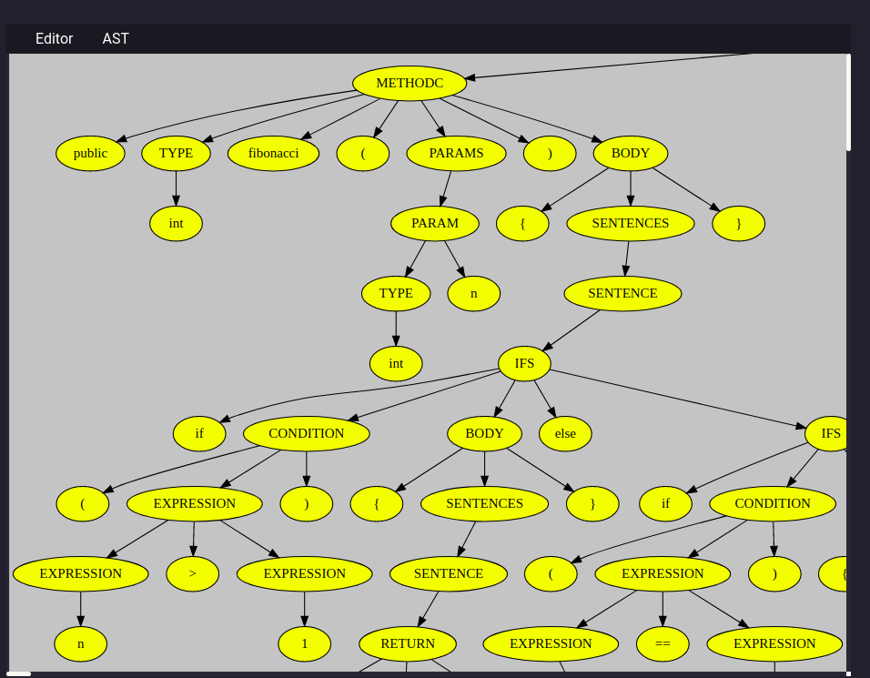
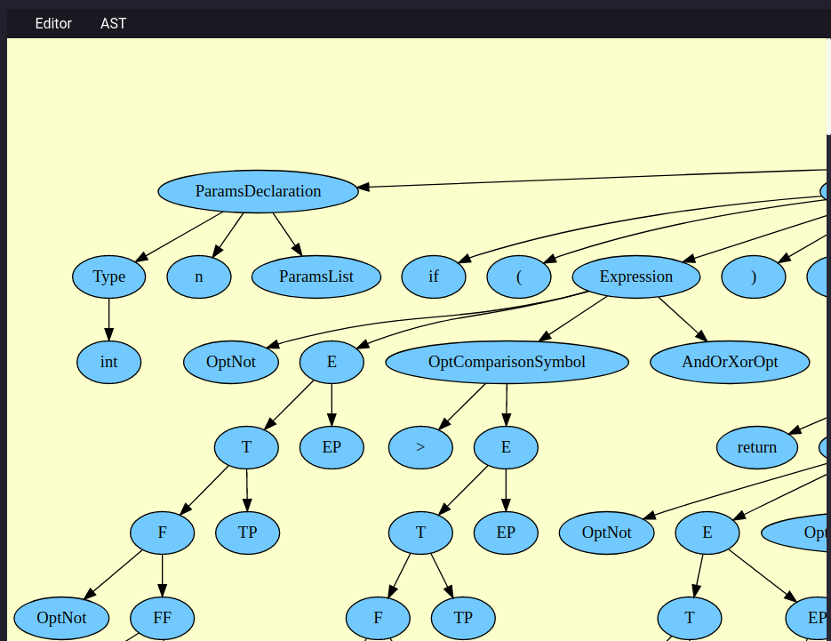
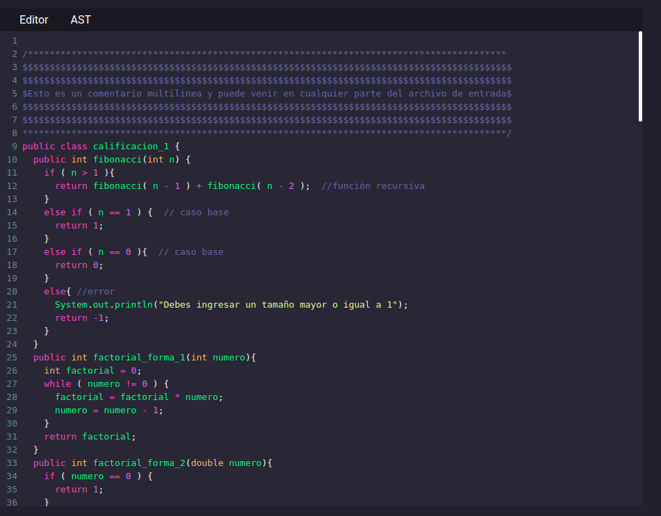
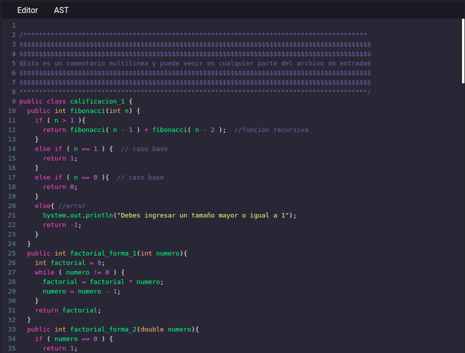

# Manual de Usuario

- [Manual de Usuario](#manual-de-usuario)
  - [Inicio](#inicio)
  - [Abrir](#Abrir)
  - [Consola](#consola)
  - [Reports](#reports)
  - [AST](#ast)
  - [Editores](#editores)

## Inicio
Ventana al iniciar la aplicacion, teniendo las siguientes opciones

1. Abrir
2. Reports
3. Consola
4. Editor
5. View Ast

## Abrir
Tiene las opciones de abir archivos para el traductor de js, py, guardar la entrada
para los archivos que tengan errores y haya que quitarlo y volverlo a compilar, tiene la opcion de guardar dicha entrada

## Consola
Aqui muestra la traduccion para los traductores de JS o Python

## Reports
En esta opcion, permite decargar traducciones, report lexico, errores o ambas traducciones

## AST
Al dar click en la opcion ast muestra los ast del traductor js o python 

## Editores
Aqui es donde se carga el archivo de entrada ya se para el JS o python

